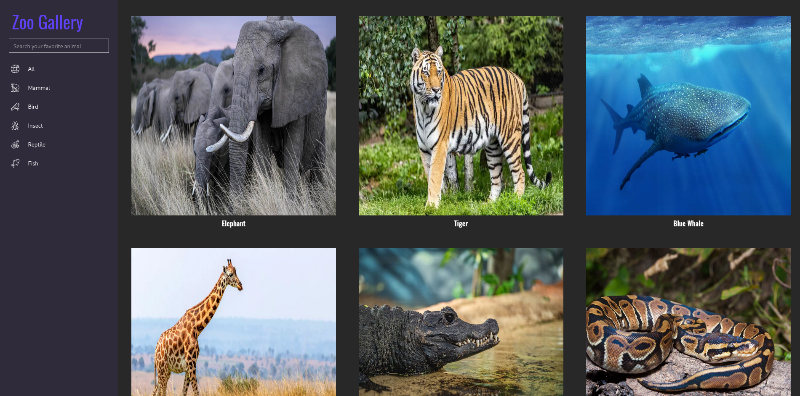
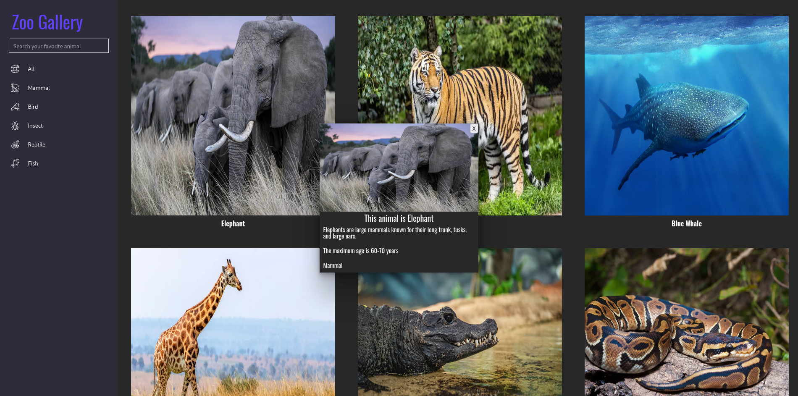

# ZooGalery Application

ZooGalery is a web application designed to showcase information about different animals in a gallery format. It consists of a frontend interface for users to interact with and view animal data.

## Features

- **Search Functionality**: Users can search for their favorite animals using the search bar provided.
- **Filter by Type**: The application allows users to filter animals by type using buttons.
- **Dynamic Display**: Animal cards are displayed dynamically based on user interactions.
- **Detailed Information**: Detailed information about each animal is provided in a pop-up window.

## Usage

To use the ZooGalery application:

1. Clone or download the repository.
2. Open a terminal and navigate to the root directory of the project.
3. Run the following command to build and start the application using Docker Compose:

    ```
    docker-compose up --build
    ```

4. Open a web browser and navigate to `http://localhost:8000` to access the ZooGalery application.

## Images

Here are some screenshots of the ZooGalery application:


Home page


popUp

## Developers

ZooGalery is developed and maintained by:

- Afonso  ([GitHub](https://github.com/CodeZobac))
- Leandro ([GitHub](https://github.com/G00li))
- Marcus ([GitHub](https://github.com/marcusbatist))
- Mccartheney ([GitHub](https://github.com/mccartheney))
- Miguel ([GitHub]())


## License

This project is licensed under the [MIT License](LICENSE).